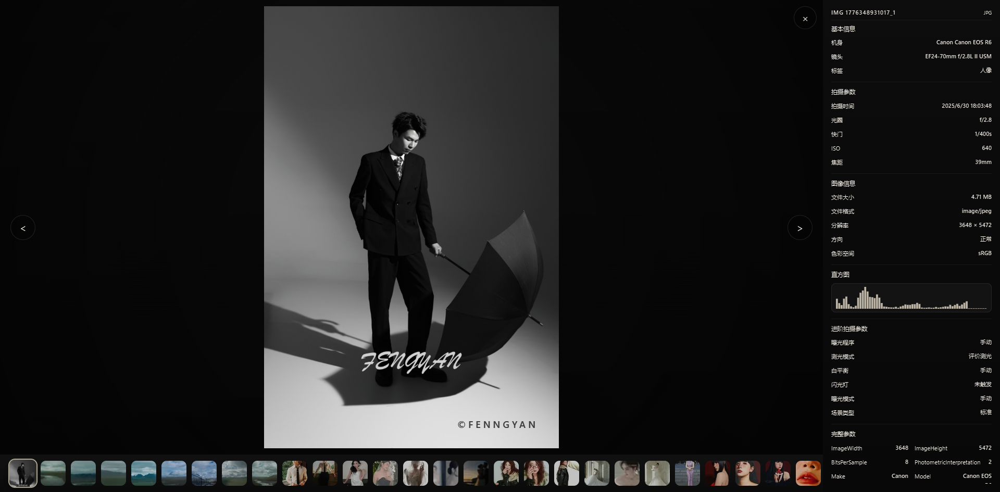
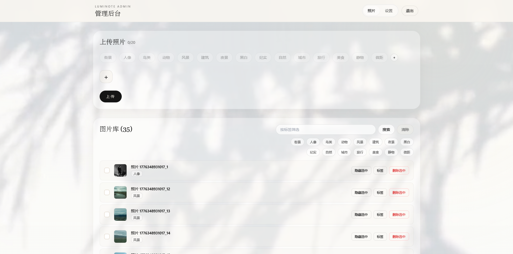
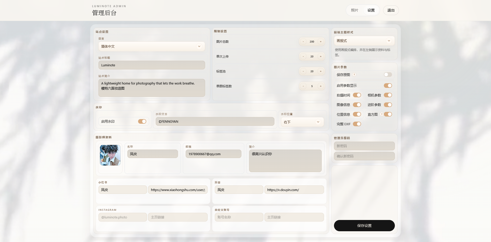

# Luminote

[English](./README.md) | [简体中文](./README.zh-CN.md)

Luminote 是一个轻量级的摄影作品集与后台管理系统，基于 Next.js 构建，并同时支持两种后端运行形态：Cloudflare Worker 部署和自托管 Node.js 部署。

## 预览图






## 项目概览

- 面向公开访问的摄影站点，支持多种首页和画廊布局
- 带登录的后台管理台，支持站点设置、标签管理、照片上传与编辑
- 支持从 EXIF 中提取部分图片元数据
- 通过共享领域服务和 API 契约，降低不同运行时之间的行为漂移
- 在同一仓库中同时提供云端部署和自托管部署模式

## 技术栈

- 前端：Next.js 15、React 18、TypeScript、Tailwind CSS
- 共享包：`packages/core`、`packages/shared`
- 云端 API：Cloudflare Workers、D1、R2
- 自托管 API：Node.js、本地文件系统、SQLite 或 JSON 文件持久化
- 图片元数据：`exifr`

## 运行模式

### Cloudflare 模式

- Web 前端运行在 Next.js / OpenNext on Cloudflare
- API 位于 `worker/`
- 元数据存储在 D1
- 图片资源存储在 R2

### 自托管模式

- Web 前端仍使用仓库根目录的 Next.js 应用
- API 运行于 `apps/api-node/`
- 图片文件存储在本地文件系统
- 元数据可使用 JSON 文件或 SQLite

## 项目结构

```text
app/                 Next.js App Router 页面
components/          公共站点与后台 UI 组件
lib/                 前端工具、API 客户端、上传辅助工具
packages/core/       与运行时无关的领域服务
packages/shared/     共享 API 类型与文本限制
worker/              Cloudflare Worker API、路由、服务、数据结构
apps/api-node/       自托管 Node.js API 运行时
docs/                架构与部署文档
public/              静态资源
```

## 快速开始

### 环境要求

- Node.js 20+
- npm
- Cloudflare 账号，仅在 Cloudflare 部署时需要
- Docker Desktop 或兼容运行时，仅在 Docker Compose 自托管时需要

### 安装依赖

在仓库根目录执行：

```bash
npm install
```

Cloudflare API 运行时：

```bash
cd worker
npm install
```

自托管 Node API：

```bash
cd apps/api-node
npm install
```

## 本地开发

### 本地 Cloudflare 开发

1. 在仓库根目录配置 `.env.local`：

```dotenv
NEXT_PUBLIC_API_BASE_URL=http://127.0.0.1:8787
API_BASE_URL=http://127.0.0.1:8787
```

2. 在 `worker/` 中准备本地 Worker 密钥：

```bash
copy .dev.vars.example .dev.vars
```

管理员密码哈希格式见 [docs/admin-password.md](docs/admin-password.md)。可通过 `cd worker && npm run hash-password -- "your-password"` 生成，并将完整的 `ADMIN_PASSWORD_HASH=pbkdf2_sha256$...` 写入 `.dev.vars`。

3. 初始化本地 D1 数据库：

```bash
cd worker
npx wrangler --config wrangler.toml d1 execute luminote-dev --local --persist-to .wrangler/state/local-speed --file schema.sql
```

4. 启动 Web 应用和 Worker：

```bash
npm run dev
```

```bash
cd worker
npm run dev
```

### 本地自托管开发

1. 在仓库根目录配置 `.env.local`：

```dotenv
NEXT_PUBLIC_API_BASE_URL=http://127.0.0.1:8788
API_BASE_URL=http://127.0.0.1:8788
```

2. 以以下任一模式启动 Node API。

文件模式：

```bash
cd apps/api-node
set CONTENT_SOURCE=file
set PERSISTENCE_DRIVER=file
set STORAGE_MODE=local
npm run start
```

SQLite 模式：

```bash
cd apps/api-node
set CONTENT_SOURCE=file
set PERSISTENCE_DRIVER=sqlite
set SQLITE_DB_FILE=apps/api-node/data/luminote.sqlite
set STORAGE_MODE=local
npm run start
```

3. 在仓库根目录启动前端：

```bash
npm run dev
```

## 常用命令

根目录：

- `npm run dev`
- `npm run build`
- `npm run start`
- `npm run lint`
- `npm run preview`
- `npm run deploy`

`worker/`：

- `npm run dev`
- `npm run deploy`
- `npm run sync:local`

`apps/api-node/`：

- `npm run dev`
- `npm run start`
- `npm run smoke`
- `npm run smoke:file`
- `npm run smoke:sqlite`

## 文档

- [docs/technical-architecture.md](docs/technical-architecture.md)：技术架构
- [docs/deployment-guide.md](docs/deployment-guide.md)：部署指南
- [apps/api-node/README.selfhosted.md](apps/api-node/README.selfhosted.md)：Node 自托管补充说明

## 推荐使用方式

- 如果你希望生产路径更贴近云原生方案，优先选择 Cloudflare 模式
- 如果你希望部署在自己的服务器或局域网环境，选择自托管 Node 模式
- 如果你想先走最简单的本地集成路径，建议先使用 Node API + SQLite
